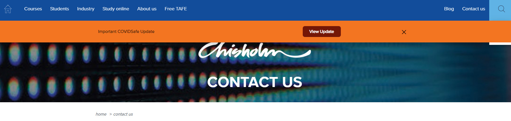

## **Welcome to Chisholm Demo Site**

[Link](https://www.chisholm.edu.au/) and 

 <html>

<body>

	<header>
		
	</header>
	

		

			_<h3>Chisholm Information_</h3>_
		

	

	<main>
		<h1>On campus or in the workplace course enquiries</h1>
		
Our enquiry hubs will operate remotely from 10 January 2022. 

		   Phone:  1300 244 746
		   Phone lines open Monday to Friday 8.30am - 5.30pm.

		   Email: enquiries@chisholm.edu.au

	</main>
	<aside>
		<h2>Apprenticeship Hub</h2>
		<h4>The Apprenticeship Hub is located in Building A, Dandenong. Entry is via the Student Hub.</h4>
	</aside>
	<footer>
			

			
Copyright &copy; Chisholm Institute 2022

		

	</footer>

<button type="button" id="chat-button" onclick="customPlugin.command('WebChat.open', getAdvancedConfig());">Start Chat</button>

</body>
</html>
